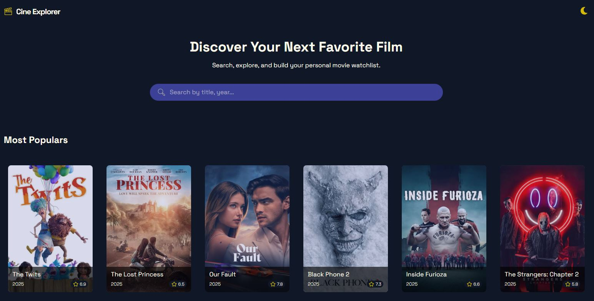
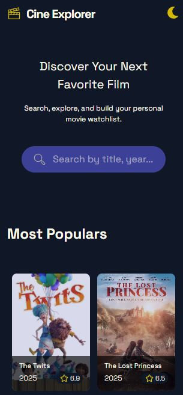

# 🎬 Film Search App

Una aplicación web moderna y responsiva para buscar y explorar películas, construida con React y alimentada por una API de películas.

🌐 **[Ver Demo en Vivo](https://film-searchapp.netlify.app/)**

---

## 📸 Screenshots

### Vista Principal




## ✨ Características

- 🎯 **Interfaz intuitiva** - Diseño limpio y fácil de usar
- 📱 **Totalmente responsiva** - Funciona perfectamente en dispositivos móviles, tablets y escritorio
- 🎨 **Diseño moderno** - UI/UX atractiva con animaciones suaves
- ⚡ **Rendimiento optimizado** - Carga rápida y experiencia fluida
- 🌐 **Datos actualizados** - Información completa de películas desde API
- 📊 **Detalles completos** - Títulos, fechas de estreno, calificaciones y más

---

## 🛠️ Tecnologías Utilizadas

- **Frontend Framework:** React 18.x
- **Estilo:** Taildwind
- **HTTP Client:** Fetch API
- **API:** The Movie Database (TMDb) 
- **Hosting:** Netlify
- **Build Tool:** Vite


## 🎯 Uso

1. **Buscar películas:** Escribe el nombre de una película en la barra de búsqueda
2. **Ver resultados:** Navega por las películas que coinciden con tu búsqueda
3. **Ver detalles:** Haz clic en cualquier película para ver información completa
4. **Explorar:** Descubre nuevas películas y guarda tus favoritas

---

## 🤝 Contribución

¡Las contribuciones son bienvenidas! Si quieres mejorar este proyecto, sigue estos pasos:

### Cómo Contribuir

1. **Fork el repositorio**
   - Haz clic en el botón "Fork" en la parte superior derecha

2. **Clona tu fork**
   ```bash
   git clone https://github.com/tu-usuario/film-search-app.git
   cd film-search-app
   ```

3. **Crea una rama para tu feature**
   ```bash
   git checkout -b feature/nueva-funcionalidad
   ```

4. **Realiza tus cambios**
   - Escribe código limpio y bien documentado
   - Sigue las convenciones de estilo del proyecto
   - Añade tests si es necesario

5. **Commit tus cambios**
   ```bash
   git add .
   git commit -m "feat: añade nueva funcionalidad increíble"
   ```

6. **Push a tu fork**
   ```bash
   git push origin feature/nueva-funcionalidad
   ```

7. **Abre un Pull Request**
   - Ve a tu fork en GitHub
   - Haz clic en "New Pull Request"
   - Describe tus cambios detalladamente

### Guías de Contribución

- Mantén el código limpio y legible
- Documenta funciones y componentes complejos
- Prueba tus cambios antes de hacer commit
- Respeta el código de conducta del proyecto

### Reportar Bugs

Si encuentras un bug, por favor [abre un issue](https://github.com/tu-usuario/film-search-app/issues) con:
- Descripción clara del problema
- Pasos para reproducirlo
- Comportamiento esperado vs actual
- Screenshots si es posible
- Tu entorno (navegador, OS, etc.)

---

## 🗺️ Roadmap

### ✅ Completado
- [x] Búsqueda básica de películas
- [x] Diseño responsivo
- [x] Integración con API
- [x] Tarjetas de películas con información básica

### 🔮 Ideas Futuras
- [ ] Sistema de favoritos con persistencia local
- [ ] Filtros avanzados (género, año, calificación)
- [ ] Modo oscuro / claro
- [ ] Internacionalización (i18n)


## 📄 Licencia

Este proyecto está bajo la Licencia MIT. Ver el archivo [LICENSE](LICENSE) para más detalles.

```
MIT License

Copyright (c) 2025 Film Search App

Se concede permiso, de forma gratuita, a cualquier persona que obtenga una copia
de este software y archivos de documentación asociados (el "Software"), para usar
el Software sin restricciones, incluyendo sin limitación los derechos para usar,
copiar, modificar, fusionar, publicar, distribuir, sublicenciar y/o vender copias
del Software...
```

---

## 👥 Autores

- **Pablo Zallio** - *Desarrollo inicial* - [@Pablo-Zallio-Dev](https://github.com/Pablo-Zallio-Dev)

Ver la lista completa de [contribuidores](https://github.com/tu-usuario/film-search-app/contributors) que han participado en este proyecto.

---

## 🙏 Agradecimientos

- [The Movie Database (TMDb)](https://www.themoviedb.org/) por proporcionar la API
- [React](https://reactjs.org/) por el framework increíble
- [Netlify](https://www.netlify.com/) por el hosting gratuito
- Comunidad open source por las librerías y herramientas

---

## 📞 Contacto

¿Tienes preguntas o sugerencias? ¡Contáctame!

- 📧 Email: pablozalliodev@gmail.com
- 💼 LinkedIn: [Pablo Zallio](https://www.linkedin.com/in/pablozalliodev/)

---

## 🌟 ¿Te gusta el proyecto?

Si este proyecto te ha sido útil, considera:

- ⭐ Darle una estrella en GitHub
- 🐛 Reportar bugs o sugerir mejoras
- 🤝 Contribuir con código
- 📢 Compartirlo con otros desarrolladores

---

<div align="center">
  
**[⬆ Volver arriba](#-film-search-app)**

Hecho con ❤️ y 💪 

</div>